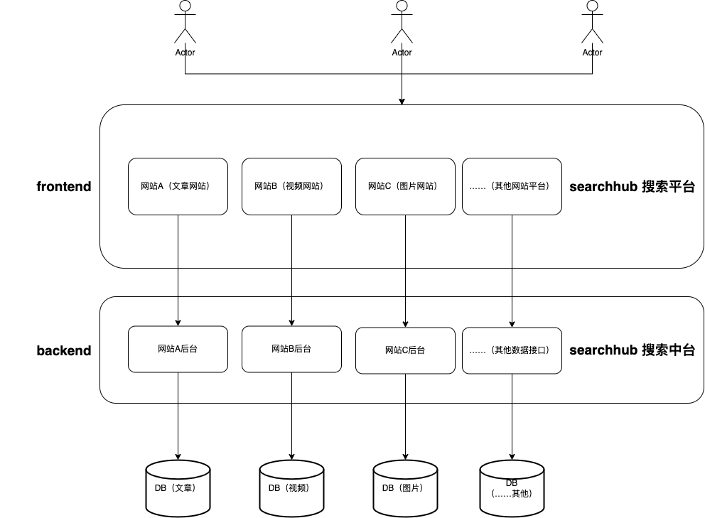

  

<h1 align="center">SearchHub</h1>

  
  
  
    

  

> 一个企业级聚合搜索平台（搜索中台）

<h2 align='center'>📌技术栈</h2>

- Java 17
- Spring Boot 2.7.12
- MyBatis & MyBatis Plus
- Druid
- MySQL
- Knife4j
- Elasticsearch（Elastic Stack）

<h2 align='center'>💪功能</h2>

- 允许用户在同一个页面集中搜索出不同来源、不同类型的内容，提升用户的检索效率和搜索体验
- 当企业中有多个项目的数据需要被搜索时，无需针对每个项目单独开发搜索功能，可以直接将数据接入搜索中台，提升开发效率

<h2 align='center'>👀架构图</h2>

